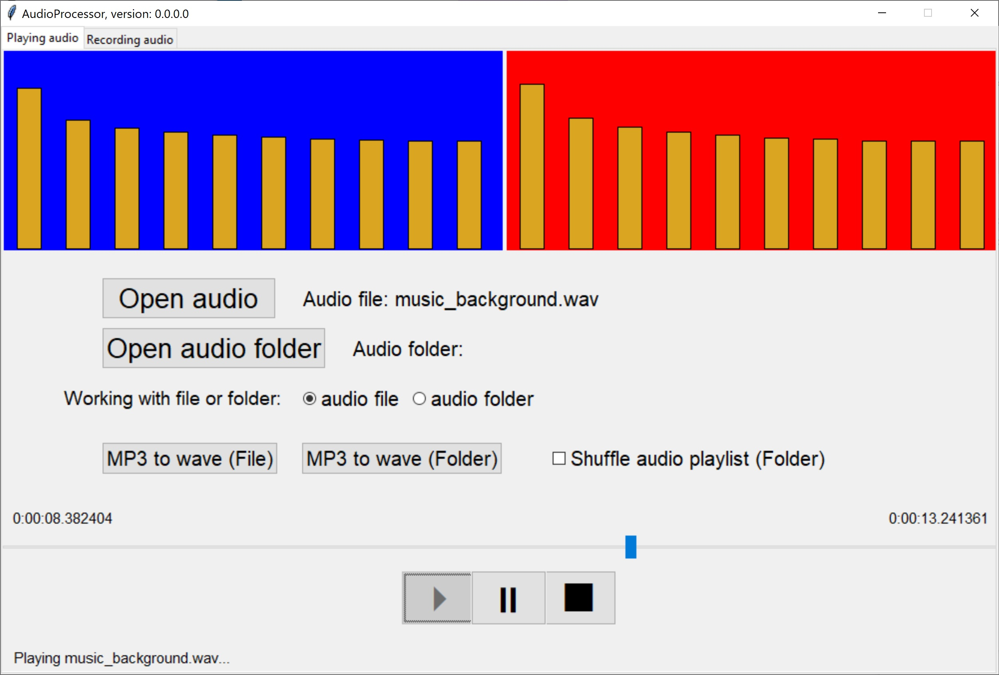

# AudioProcessor
### Latest version 0.0.0.0
1) You can play an **audio** file or all audio files in a folder.
2) It plays and shows frequency bars of the audio.
3) It plays audio files in wave format; but you may convert **mp3** files to **wave** format to use them too.
4) It can record sound from **microphone** either in wave and/or in mp3 format.
## This archive includes the executable program, **AudioProcessor.exe**, which you should click on to run.
[Download the archive for win64 (Windows 10 and over)](https://drive.google.com/file/d/1GcjKEWJcUEZzPX_s_jdiT27mxg0hUDIK/view?usp=share_link)
---
 *Figure 1: A snapshot of AudioProcessor, version 0.0.0.0, while playing the audio file.*
---
